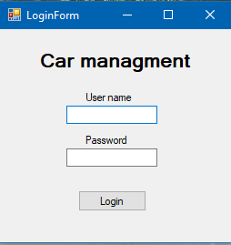
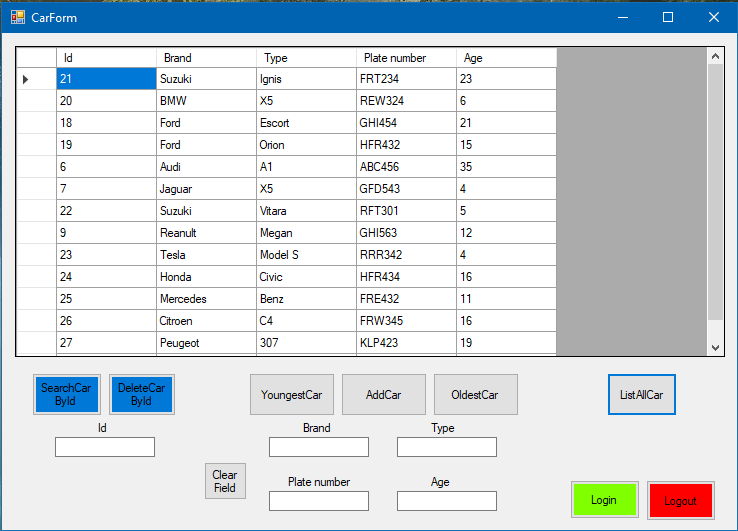

## WCF Cars

Ebben a projektben a WCF technologiával ismerkedtem meg, C# segítségével. Létrehoztam egy adatbázist, melyben autókat tudunk tárolni, 
van egy szerver odlal, amihez készület egy Host-oló, valamint egy kliens oldal. A Host-oló indítása után 2 Kliens feltud csatlakozni
és bármi féle probléma nélkül tudják szerkeszteni az adatbázisban lévő autókat.

